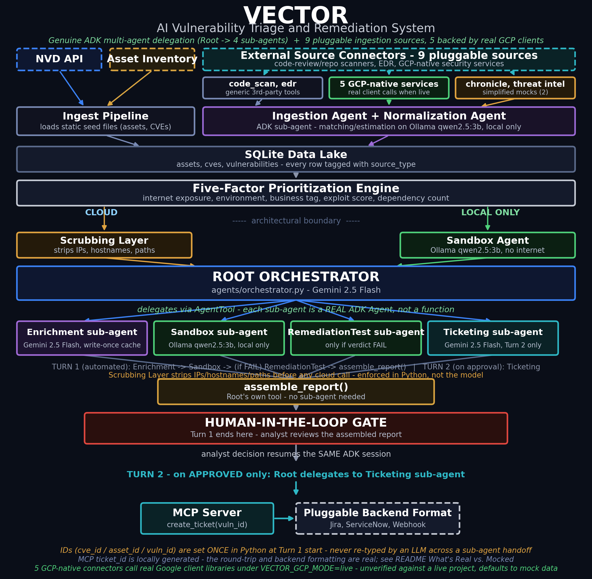

# VECTOR - Vulnerability Evaluation, Control & Targeted Orchestrated Remediation

**VECTOR** is an AI-orchestrated vulnerability triage and remediation system: it ingests CVE and asset data, prioritizes what actually matters in your environment, tests a remediation in a sandbox before anyone touches production, and gates every ticket behind human approval. This repo is a working capstone prototype of the ingestion, prioritization, and human-gated remediation-testing workflow. Please note that this is a stripped-down version of the VECTOR capability that is currently being developed and tested.

> ⚠️ **Caution:** VECTOR has been developed and tested in a lab environment only. It has not been hardened, security-reviewed, or validated against a production workload. Any use in a production environment should be independently evaluated and tested by your own team before deployment.

> **Google 5-Day AI Agents Capstone Project**
> Built in 5 days (June 30 – July 4, 2026) by Zonar.Z09
> Developed end-to-end in [Google Antigravity](https://antigravity.google/), Google's agentic IDE

[](https://python.org)
[](LICENSE)

---

## Problem Statement

Security teams are drowning in CVE noise, and the gap between attacker speed and defender speed is widening fast. Per the VECTOR whitepaper's research: roughly 50,000 CVEs were published in 2025 (~130/day), median time-to-exploit has collapsed to about 5 days, yet the median time to close half of an organization's internet-facing vulnerabilities is 361 days - a roughly 72x "Remediation Delta." About 60% of breaches involve exploitation of a known vulnerability for which a patch was already available (IBM, Verizon, VulnCheck, Flashpoint - see whitepaper citations).

A CVSS 9.8 score means nothing if the affected service isn't deployed in your environment, isn't internet-exposed, and has no dependent systems. Without context, every critical CVE looks equally urgent. With analyst hours as the bottleneck, teams end up patching in CVSS order and missing the vulnerabilities that actually put the business at risk.

## Solution

VECTOR is a multi-agent AI system that ingests public CVE data, maps it against your asset inventory, and produces prioritized, actionable remediation plans with a human-in-the-loop approval gate before any ticket is created.

It implements five of the foundational design principles from the VECTOR whitepaper:
1. **Hybrid AI routing** - public CVE data goes to Gemini in the cloud; sensitive asset configuration stays on a local model (Ollama). The boundary is enforced in code, not policy.
2. **Context over score** - the five-factor prioritization engine ranks by environmental exploitability (internet exposure, environment, business criticality, dependency blast radius), not raw CVSS.
3. **Write-once enrichment cache** - Gemini enriches each CVE exactly once; subsequent pipeline runs use the cached result.
4. **Human-in-the-loop governance** - no remediation ticket is created without explicit analyst approval. The gate is a hard block, not a timeout.
5. **Closed-loop verification** - the RemediationTest sub-agent re-tests a proposed fix in the sandbox before the report ever reaches the analyst.

The live pipeline is also a genuine ADK multi-agent system: a Root Orchestrator delegates real work to four independent ADK sub-agents (Enrichment, Sandbox, RemediationTest, Ticketing) via `AgentTool` - each sub-agent has its own model turn and tools, rather than the Root doing everything itself through flat function calls.

### Why This Matters for a GCP-Hosted Organization

Security teams running production workloads in GCP typically triage findings from several disconnected consoles - Security Command Center, Cloud Asset Inventory, Artifact Analysis, Cloud DLP, IAM Recommender - each with its own severity scale and no shared view of which finding actually matters given the asset it landed on. VECTOR is built to close that gap end-to-end, not just surface the findings:

- **One prioritized queue, not five consoles.** All native GCP finding types feed the same five-factor prioritization engine as CVE data, ranked against the same asset context (internet exposure, environment, business criticality, dependency blast radius) - so a Cloud DLP finding on an internal dev box doesn't out-rank an SCC finding on an internet-facing prod service just because it arrived from a different tool.
- **Remediation is tested before a ticket is opened, not just proposed.** The Sandbox and RemediationTest sub-agents evaluate a proposed fix against the asset's actual configuration before any ticket is created, so analysts review a verified remediation plan rather than a raw finding they still have to investigate themselves.
- **Governance is enforced in code, not policy.** No ticket is created without an explicit analyst approval - `create_ticket` hard-rejects any call where `approved` isn't literally `True`. This matters for organizations where GCP finding volume already outstrips analyst headcount, but full automation isn't acceptable for compliance or change-control reasons.
- **Sensitive asset data never leaves the organization's perimeter.** Asset configuration is only ever reasoned about by the local Ollama model; only public CVE/finding descriptions are sent to the cloud LLM. This split is enforced in code (see "Cloud / Local Split" below), not left to prompt discipline.
- **Deployable against a real GCP org, not just this demo.** `VECTOR_GCP_MODE=live` plus a documented IAM role set (see "Deploying Against a Real GCP Environment" below) lets a security team point the same pipeline at their own project or org. Adding a new finding source later is one `fetch_*` function - prioritization, the dashboard, and ticketing all work unchanged.

---

## Architecture



```
┌──────────────┐    ┌─────────────────┐
│   NVD API    │    │ Asset Inventory  │
│ (real data)  │    │   (synthetic)    │
└──────┬───────┘    └────────┬────────┘
       └──────────┬──────────┘
                  ▼
         ┌─────────────────┐
         │ Ingest Pipeline │   SQLite data lake
         └────────┬────────┘
                  ▼
    ┌─────────────────────────┐
    │ Five-Factor Prioritiza- │
    │ tion Engine (scored,    │   internet exposure · environment ·
    │ ranked vulnerability    │   business tag · exploit score ·
    │ queue)                  │   dependency count
    └──────┬──────────┬───────┘
           │          │
    ───────────────────────────────── architectural boundary
    ☁️ CLOUD           │        🖥️ LOCAL ONLY
           │          │
    ┌──────▼──────┐   │   ┌──────────────┐
    │  Scrubbing  │   │   │ Sandbox Agent│
    │    Layer    │   │   │ Ollama        │
    │ (strips IPs,│   │   │ qwen2.5:3b   │
    │ hostnames,  │   │   │ no internet  │
    │ paths)      │   │   │ access       │
    └──────┬──────┘   │   └──────┬───────┘
           ▼          │          │
                      │          │
    ══════════════════▼══════════▼══════════════════════════════════════
              ROOT ORCHESTRATOR (agents/orchestrator.py, Gemini 2.5 Flash)
              delegates to 4 real ADK sub-agents via AgentTool -
              each sub-agent has its OWN model turn and tools, not a
              plain function dressed up as an "agent"
    ══════════════════════════════════════════════════════════════════

         TURN 1 (automated):
           delegate → enrichment_agent sub-agent (Gemini 2.5 Flash)
                        analyzes the CVE itself, calls save_enrichment
                        with structured typed args, write-once cached
           delegate → sandbox_agent sub-agent (Ollama, local only)
           if verdict FAIL:
             delegate → remediation_agent sub-agent (Ollama, local only)
           call assemble_report() - Root's own tool, pure data assembly,
                        no sub-agent needed (no judgment call to make)
                       ▼
          ┌────────────────────────┐
          │  HUMAN-IN-THE-LOOP     │  ◄── Turn 1 ends here; session paused,
          │       GATE             │       analyst reviews the assembled report
          └────────────┬───────────┘
                       │ analyst decision resumes the SAME ADK session
                       ▼
         TURN 2 - on APPROVED only:
           delegate → ticketing_agent sub-agent → create_ticket via
                        real MCP round-trip
                       ▼
              ┌─────────────────┐        ┌───────────────────────────┐
              │   MCP Server    │───────►│ Pluggable backend format: │
              │  create_ticket  │        │ Jira / ServiceNow / Webhook│
              └─────────────────┘        └───────────────────────────┘
```

The two-turn design is what lets a blocking human decision coexist with
ADK's async tool-calling loop: Turn 1 runs fully automated and stops:
Turn 2 resumes the identical session once a decision exists, and only
then is `create_ticket` callable - the tool itself hard-rejects any call
where `approved` isn't literally `True`. See `agents/orchestrator.py`'s
module docstring for the full design rationale.

Exact CVE/asset/vuln IDs are set once, in Python, when Turn 1 starts -
they are never re-typed by any LLM across a sub-agent handoff. This isn't
a stylistic choice: an early live test caught a sub-agent transposing a
digit in a CVE ID while delegating between agents, silently losing the
real CVE record. Every sub-agent's tool now reads IDs from that one
trusted source instead.

`web/pages/5_Batch_Remediation.py` drives the same two-turn session for
multiple CVE×asset pairs at once: it runs Turn 1 for every selected pair,
shows all assembled reports together, then fires each item's Turn 2
independently once the analyst approves or rejects it.

### Cloud / Local Split - Why

| Agent | Model | Why This Tier |
|---|---|---|
| Enrichment sub-agent | Gemini 2.5 Flash (cloud) | CVE descriptions are public data - safe to send to cloud. Native ADK support, no wrapper needed |
| Sandbox sub-agent | Ollama qwen2.5:3b (local) | Asset configs are internal - never leave the machine |
| RemediationTest sub-agent | Ollama qwen2.5:3b (local) | Retests the proposed fix against the same asset config - internal, never leaves the machine |
| Root Orchestrator + Ticketing sub-agent | Gemini 2.5 Flash (cloud) | Delegation/orchestration and ticket-backend selection only; never sees raw asset data |

---
Note: based on your specs you can use Gemma as well
### Extensible Ingestion - Beyond the Static Seed Files

`src/ingest/ingest_pipeline.py` loads the static `data/assets.json` / `data/cve_seed_list.json`
seed files once. On top of that, `agents/ingestion_agent.py` is a second, pluggable
ingestion path that shows how VECTOR would pull continuously from real security
tooling - code review / repo scanners (SAST), EDR/endpoint platforms, and
Google Security Command Center (Event Threat Detection, Web Security Scanner).

Each source is a connector function in `src/ingest/connectors.py` (`SOURCE_CONNECTORS`
registry - the same pluggable-backend pattern already used for ticketing in
`src/integrations/ticketing.py`'s `TICKET_BACKENDS`). Every connector here returns
synthetic sample records shaped like the real tool's actual output, with a comment
showing exactly which real API call it stands in for. A local-only Ollama agent
(`agents/normalization_agent.py`, same architectural tier as `sandbox_agent.py`)
matches each finding to an existing asset (or proposes a new one) and estimates
the risk fields the rest of the pipeline needs, wrapped in an ADK sub-agent
(`agents/ingestion_agent.py`) that mirrors the Root Orchestrator's sub-agent
pattern. Ingested records land in the same `assets`/`cves`/`vulnerabilities`
tables as the seed data, tagged with a `source_type` column (`synthetic_seed`,
`code_scan`, `edr`, `gcp_scc:<category>`, `cloud_asset_inventory`,
`artifact_analysis`, `cloud_dlp`, `iam_recommender`, `chronicle_secops`,
`threat_intel`) so their origin stays visible everywhere downstream - the
prioritization engine and dashboard need no changes to consume them.

Nine connectors in total (`src/ingest/connectors.py`): `code_scan` and `edr`
(generic third-party tooling), five real GCP-native services (`gcp_scc` -
unified across all 7 Security Command Center detector categories,
`cloud_asset_inventory`, `artifact_analysis`, `cloud_dlp`,
`iam_recommender`), and two deliberately-labeled simplifications
(`chronicle_secops`, `threat_intel`) whose real products don't fit this
connector's discrete-findings shape - see their docstrings in
`connectors.py` for exactly why, rather than pretending they're realistic.

Try it: `streamlit run web/Overview.py` → **External Sources** page, or
`python -m agents.ingestion_agent` from the CLI.

To wire in a real source later: implement one new `fetch_*` function in
`src/ingest/connectors.py` that calls the real API instead of returning
synthetic data, add it to `SOURCE_CONNECTORS`, and everything downstream
(normalization, DB writes, dashboard, prioritization) already works unchanged.
Five of the nine connectors already have this done for real - see "Deploying
Against a Real GCP Environment" below.

### Deploying Against a Real GCP Environment

Five connectors (`gcp_scc`, `cloud_asset_inventory`, `artifact_analysis`,
`cloud_dlp`, `iam_recommender`) have a real implementation in
`src/ingest/gcp_client.py`, gated behind `VECTOR_GCP_MODE` so the default
demo path never needs GCP credentials.

**This path is unverified** - see the "Real code, unverified" row above and
`gcp_client.py`'s module docstring. It's written correctly against the
documented API shapes but has not been run against a live project. Expect to
debug field names/enum values/pagination against your actual project.

**Setup:**

1. Enable these APIs on your GCP project: Security Command Center, Cloud
   Asset, Container Analysis, Cloud DLP, Recommender.
2. Create a service account with these roles: `roles/securitycenter.findingsViewer`
   (org-level, for full SCC coverage), `roles/cloudasset.viewer`,
   `roles/containeranalysis.occurrences.viewer`, `roles/dlp.reader`,
   `roles/recommender.iamViewer`.
3. Authenticate: `gcloud auth application-default login` locally, or attach
   the service account via Workload Identity if running inside GCP
   (Compute Engine, Cloud Run, GKE).
4. Install the GCP client libraries: `pip install -r requirements.txt`
   (they're listed but only imported lazily - the mock path works without
   them installed).
5. Set env vars:
   ```
   VECTOR_GCP_MODE=live
   GCP_PROJECT_ID=your-project-id
   GCP_ORG_ID=your-org-id          # optional - enables org-level SCC coverage
   ```
6. Run the same entry points as the mock path - nothing about how it's
   invoked changes: `python -m agents.ingestion_agent`, or the Streamlit
   **External Sources** page (which shows a live-mode warning banner when
   `VECTOR_GCP_MODE=live` is set).

`chronicle_secops` and `threat_intel` have no live counterpart - they
require separate products/APIs (Chronicle SecOps, VirusTotal) outside
standard GCP project IAM, and always return mock data regardless of
`VECTOR_GCP_MODE`.

---

## Five-Factor Risk Model

Scores each vulnerability (0–1) across five weighted factors:

| Factor | Source Field | Default Weight |
|---|---|---|
| Internet Exposure | `internet_exposed` (bool) | 0.25 |
| Environment Class | `environment` (prod/staging/dev) | 0.20 |
| Exploit Capability | `cvss_score` / 10 | 0.25 |
| Business Criticality | `business_tag` (critical/high/medium/low) | 0.20 |
| Dependency Score | `dependencies_json` (count) | 0.10 |

Weights sum to 1.0 and are configurable in `src/engine/prioritization.py`.

---

## What's Real vs. Mocked

This transparency section protects against any assumption that this is a live enterprise integration.

| Component | Status | Notes |
|---|---|---|
| CVE data (descriptions, CVSS) | **Real** | From NIST NVD API |
| Gemini enrichment | **Real** | The live path's Enrichment sub-agent (`gemini-2.5-flash`) analyzes the CVE directly in its own reasoning turn and calls `save_enrichment` with typed arguments - not a hidden raw API call parsed from free text. The standalone `EnrichmentAgent` class (used only by the Run Pipeline UI page) does call Gemini directly via `google.genai.Client` |
| Local sandbox reasoning | **Real** | Ollama `qwen2.5:3b` running locally |
| Remediation retest | **Real** | Ollama `qwen2.5:3b`, only runs when the sandbox verdict is FAIL |
| ADK multi-agent delegation | **Real** | A Root Orchestrator (`gemini-2.5-flash`) delegates to 4 independent ADK sub-agents (Enrichment, Sandbox, RemediationTest, Ticketing) via `AgentTool` - each is a real `google.adk.agents.Agent` with its own model turn, not a plain function. `agents/orchestrator.py` drives the two-turn human-in-the-loop session and is the live path (`full_pipeline.py`, the Streamlit "Run Pipeline" and "Batch Remediation" pages all go through it) |
| Ticket creation round-trip | **Real** | `create_ticket` genuinely calls the MCP server via the stdio client (`src/integrations/ticketing.py`); requires `approved=True`, hard-enforced in code |
| Ticket ID / external system | **Synthetic** | The MCP server's `create_ticket` (`mcp_server/day1_server.py`) returns a locally-generated ID - it does not call a real Jira/ServiceNow API. What *is* real: the MCP round-trip, and the pluggable Jira/ServiceNow/webhook payload formatting built on top of that ID |
| Asset inventory | **Synthetic/Mocked** | 15 fake assets in `data/assets.json` |
| Scanner feeds | **Mocked** | CVE–asset pairings are generated synthetically |
| NVD API enrichment | **Mocked** | NVD key was pending activation; CVE seed list used instead |
| External source connectors - `code_scan`, `edr` | **Mocked, hooks are real** | `src/ingest/connectors.py` returns synthetic sample records shaped like each real tool's output. The Ingestion sub-agent (`agents/ingestion_agent.py`) genuinely runs, normalizes, and writes them to the data lake - only the fetch step is a stand-in for a real API call |
| External source connectors - `gcp_scc`, `cloud_asset_inventory`, `artifact_analysis`, `cloud_dlp`, `iam_recommender` | **Real code, unverified** | `src/ingest/gcp_client.py` calls the actual Google client libraries (`google-cloud-securitycenter`, `-asset`, `-containeranalysis`, `-dlp`, `-recommender`) via `VECTOR_GCP_MODE=live`. This is a third category, distinct from both rows above: it is not synthetic data, but it has never been run against a live GCP project (none was available while building it) - treat it as a reference implementation to verify against your own project, not a tested integration. Defaults to mock data (`VECTOR_GCP_MODE=mock`) so the demo never needs GCP credentials. See "Deploying Against a Real GCP Environment" below |
| External source connectors - `chronicle_secops`, `threat_intel` | **Mocked, deliberately simplified** | Google SecOps (Chronicle) is log/telemetry-based (query or stream, not a findings list) and VirusTotal/Mandiant are indicator-centric, not asset-bound - neither fits this connector's discrete-findings shape honestly. These two mocks are labeled simplifications rather than forced into looking like real integrations; see their docstrings in `connectors.py` for what a genuine integration would actually require |

---

## Project Structure

```
/agents
  enrichment_agent.py       ← Gemini-based CVE enrichment class (standalone, used only by the Run Pipeline UI page's single-agent demo)
  sandbox_agent.py          ← Ollama-based local validation (never calls internet)
  remediation_test_agent.py ← Ollama-based remediation retest (local only, runs only on sandbox FAIL)
  normalization_agent.py    ← Ollama-based local matching/normalization of external-source findings against the asset inventory
  playbook_agent.py         ← Report assembly (build_report) + legacy standalone run() path
  orchestrator.py           ← Root Orchestrator + 4 real ADK sub-agents (Enrichment/Sandbox/RemediationTest/Ticketing) via AgentTool - the live two-turn, multi-agent, human-in-the-loop path
  ingestion_agent.py        ← Ingestion sub-agent: pulls from pluggable external source connectors, normalizes via normalization_agent.py, writes to the data lake
  full_pipeline.py          ← End-to-end CLI pipeline; drives agents/orchestrator.py
  day2_orchestrator.py      ← Day 2 ADK orchestrator (enrichment → sandbox handoff only) - superseded by orchestrator.py, kept for history
  hello_adk.py              ← Day 0 ADK hello-world verification agent

/mcp_server
  day1_server.py         ← MCP server: get_asset_inventory, get_vulnerability_record, create_ticket
  server.py              ← Day 0 ping/status tools

/src
  /db/database.py             ← SQLite schema (assets, cves, vulnerabilities, enrichments) - all three tag rows with source_type
  /ingest/ingest_pipeline.py  ← Loads assets.json + CVE seeds into DB (source_type='synthetic_seed')
  /ingest/connectors.py       ← Pluggable external source connectors (9 sources - code_scan/edr/gcp_scc/cloud_asset_inventory/artifact_analysis/cloud_dlp/iam_recommender/chronicle_secops/threat_intel) - mock by default, dispatches to gcp_client.py for 5 of them when VECTOR_GCP_MODE=live
  /ingest/gcp_client.py       ← Real (unverified) Google client library calls backing the 5 GCP-native connectors - see its docstring for the honesty disclaimer
  /engine/prioritization.py   ← Five-factor scoring engine
  /security/scrubber.py       ← Mandatory scrubbing layer (strips IPs/hostnames/paths)
  /integrations/ticketing.py  ← Real MCP ticket creation + pluggable Jira/ServiceNow/webhook formatting

/web                          ← Streamlit dashboard (view layer only)
  app.py                 ← Overview page: metrics + top-10 risk table
  data_access.py         ← Thin DB query helpers (zero business logic)
  /pages
    1_Asset_Inventory.py       ← Filterable asset table + breakdown chart
    2_Vulnerability_Explorer.py ← Vuln table with enrichment badges + detail panel
    3_Run_Pipeline.py          ← Interactive enrichment + sandbox + scrub-log display
    4_Weight_Configuration.py  ← Live weight sliders + reranking table
    5_Batch_Remediation.py     ← Multi-select batch triage + per-item approve/reject via the ADK orchestrator
    6_External_Sources.py      ← Extensibility hook: run the pluggable source connectors + ingestion agent, see normalized results

/data
  assets.json            ← 15 synthetic assets with five-factor fields
  cve_seed_list.json     ← 10 real CVE IDs with descriptions + CVSS scores

/cli
  main.py                ← Click CLI (status, verify, run commands)

/tests                   ← pytest suite (123+ tests) covering every module above
  conftest.py                    ← Shared fixtures (hermetic temp-DB isolation, anyio backend)
  test_cli.py, test_database.py, test_data_access.py, test_prioritization.py,
  test_scrubber.py, test_enrichment_agent.py, test_sandbox_agent.py,
  test_remediation_test_agent.py, test_playbook_agent.py, test_ticketing.py

vector.py                ← Root CLI entry point
verify_day0.py           ← Day 0 verification suite
verify_day1.py           ← Day 1 verification suite
verify_day2.py           ← Day 2 verification suite
verify_day3.py           ← Day 3 verification suite (8/8)
verify_web.py            ← Web dashboard verification suite (22/22)
verify_phase2.py         ← Phase 2 verification suite (RemediationTestAgent, ticketing, two-turn orchestrator, secret hygiene)
```

---

## Setup

### Prerequisites

- Python 3.12+
- [Ollama](https://ollama.ai) installed and running (`ollama serve`)
- Ollama model pulled: `ollama pull qwen2.5:3b`

### Install

```bash
git clone https://github.com/Zonar-z09/AI-Agents-Capstone-Project.git
cd AI-Agents-Capstone-Project
pip install -r requirements.txt
```

### Configure

```bash
cp .env.example .env
```

Edit `.env` with your keys:

```
NVD_API_KEY=your_nvd_api_key_here         # https://nvd.nist.gov/developers/request-an-api-key
GOOGLE_API_KEY=your_google_key_here        # https://aistudio.google.com/apikey - powers every Gemini call: the Root Orchestrator, all 4 sub-agents, and the standalone EnrichmentAgent class
ANTHROPIC_API_KEY=your_anthropic_key_here  # optional/legacy - only verify_day0.py's historical Day 0 check still references this; nothing in the live pipeline calls Claude anymore
```

### Populate the database

```bash
python src/ingest/ingest_pipeline.py
```

---

## Running the CLI

```bash
# Show help
python vector.py --help
python vector.py run --help

# Run the full pipeline on a specific CVE
python vector.py run --cve CVE-2021-44228

# Run on a specific CVE + asset pairing
python vector.py run --cve CVE-2024-6387 --asset ASSET-001

# Run on the top 5 highest-priority vulnerabilities
python vector.py run --top 5

# Run without the human gate (automated testing only)
python vector.py run --top 3 --auto-approve

# Show system status
python vector.py status
```

The pipeline stages, driven by `agents/orchestrator.py`'s two-turn ADK session:
1. **Stage 1** - Checks the data lake (auto-ingests if empty)
2. **Stage 2** - Prioritizes targets by five-factor score
3. **Stage 3-5 (Turn 1)** - Root delegates to the Enrichment sub-agent (Gemini, cloud) → delegates to the Sandbox sub-agent (Ollama, local) → if the sandbox verdict is FAIL, delegates to the RemediationTest sub-agent (Ollama, local) → assembles the report. All automated; the ADK session then pauses.
4. **HUMAN APPROVAL GATE** - analyst reviews the assembled report, approves or rejects
5. **Turn 2** - resumes the same ADK session with the decision; on approval, creates the ticket via a real MCP round-trip

---

## Web Dashboard

A 7-page Streamlit dashboard sits on top of the verified backend as a read/interact layer.
It imports and calls the existing `src/` and `agents/` modules directly - no logic is duplicated.

```bash
# Start the dashboard
streamlit run web/Overview.py
```

| Page | URL path | What it does |
|---|---|---|
| Overview | `/` | 4 metric tiles (assets, CVEs, open vulns, enriched count) + top-10 risk table |
| Asset Inventory | `/Asset_Inventory` | Filterable table (env / criticality / internet-exposed) + dep count + bar chart |
| Vulnerability Explorer | `/Vulnerability_Explorer` | All 10 vulns with enrichment-status badges (✅ Cached / ⬜ Not enriched) + detail expander |
| Run Pipeline | `/Run_Pipeline` | CVE + Asset dropdowns → Run Enrichment (Gemini) → scrub-log display → Run Sandbox (Ollama) → verdict badge |
| Weight Configuration | `/Weight_Configuration` | 5 live sliders → sum validation → instant reranking table + preset buttons |
| Batch Remediation | `/Batch_Remediation` | Multi-select or top-N picker → ticket backend selector → batch Turn 1 triage with progress → per-item approve/reject review → batch Turn 2 submission with a delivered/rejected summary |
| External Sources | `/External_Sources` | Connector checklist (9 sources) → Run Ingestion → per-record normalized results table; shows a live-mode warning banner when `VECTOR_GCP_MODE=live` |

**Design rules enforced:**
- Dashboard is a **view layer only** - `web/data_access.py` contains no scoring, enrichment, or validation logic
- Agent instances are cached (`@st.cache_resource`); query results are not (reads stay fresh after pipeline writes)
- Weight sliders **warn** when sum ≠ 1.0 - they do not silently renormalize (per whitepaper design)
- Scrubbing layer redactions are surfaced visibly in the Run Pipeline page
- CLI `vector run` command continues to work unmodified (Agent Skills credit preserved)

**What's mocked vs. real in the dashboard:**
Same as the CLI - see the [What's Real vs. Mocked](#whats-real-vs-mocked) table above.
The dashboard adds no new mocking; it calls the same agents the CLI does.

---

## Running the MCP Server

```bash
python mcp_server/day1_server.py
```

Available tools:
- `get_asset_inventory()` - returns all assets from the data lake
- `get_vulnerability_record(vuln_id)` - returns a specific vulnerability record
- `create_ticket(vuln_id)` - returns a locally-generated ticket ID (the tool itself doesn't call a real Jira/ServiceNow API - see the "Ticket ID / external system" row in [What's Real vs. Mocked](#whats-real-vs-mocked))

`src/integrations/ticketing.py` is the real caller of this tool (via the same stdio-client pattern as `mcp_server/test_day1_client.py`), and layers pluggable Jira/ServiceNow/webhook payload formatting on top of the ID it returns. `agents/orchestrator.py`'s Turn 2 is what invokes it, gated on `approved=True`.

---

## Verification Suites

```bash
# Start Ollama first
ollama serve

# Day 0: environment + SDK setup
python -X utf8 verify_day0.py

# Day 1: ingestion, prioritization, MCP server
python -X utf8 verify_day1.py

# Day 2: enrichment cache, scrubbing, sandbox, ADK pipeline
python -X utf8 verify_day2.py

# Day 3: CLI, 3-CVE pipeline, human gate, secret hygiene  [8/8]
python -X utf8 verify_day3.py

# Web dashboard: data_access unit tests + AppTest headless UI  [22/22]
python -X utf8 verify_web.py

# Phase 2: RemediationTestAgent, ticketing backends/approval gate,
# two-turn ADK orchestrator (live), full_pipeline.py live path, secret hygiene
python -X utf8 verify_phase2.py

# Full pytest regression suite (123+ tests, hermetic - no live API calls)
pytest
```

---

## Evaluation Checklist

| Criterion | Implementation | File |
|---|---|---|
| MCP Server | Three tools exposed via Python MCP SDK, genuinely called (not just defined) by the ticketing layer | `mcp_server/day1_server.py`, `src/integrations/ticketing.py` |
| Agent Skills (CLI) | `vector run --cve / --top` CLI command | `vector.py`, `cli/main.py` |
| Human-in-the-Loop | Two-turn ADK session: Turn 1 auto-triages and pauses; Turn 2 resumes the same session with the analyst's decision and hard-gates ticket creation on `approved=True` | `agents/orchestrator.py` |
| Multi-Agent Architecture | A Root Orchestrator delegates to 4 independent ADK sub-agents (Enrichment, Sandbox, RemediationTest, Ticketing) via `AgentTool` - real `Agent`-to-`Agent` delegation, each sub-agent with its own model turn and tools, not flat function calls dressed up as agents. Live two-turn path used by both the CLI and the web UI | `agents/orchestrator.py` |
| Security Feature | Scrubbing layer strips PII before cloud calls | `src/security/scrubber.py` |
| Write-Once Cache | Enrichment cached in SQLite `enrichments` table | `agents/orchestrator.py` (live path), `agents/enrichment_agent.py` (standalone UI class) |
| Cloud / Local Split | Gemini for CVEs (public); Ollama for assets and remediation retesting (sensitive) | Design decision |
| Five-Factor Model | Configurable weights summing to 1.0 | `src/engine/prioritization.py` |
| Pluggable Ticketing | Real MCP ticket creation, formatted per backend (Jira/ServiceNow/webhook) on top of the same underlying ticket | `src/integrations/ticketing.py` |
| Web Dashboard | 6-page Streamlit UI - view layer + batch remediation over the same orchestrator the CLI uses | `web/Overview.py`, `web/pages/` |
| Extensible Ingestion | 9 pluggable source connectors (code scan, EDR, 5 real GCP-native services, 2 labeled simplifications) feeding a local-only normalization sub-agent; 5 connectors also have a real (unverified) GCP client integration behind `VECTOR_GCP_MODE=live` | `src/ingest/connectors.py`, `src/ingest/gcp_client.py`, `agents/normalization_agent.py`, `agents/ingestion_agent.py` |
| Automated Test Coverage | 123+ pytest tests (hermetic, mocked I/O) across every module, plus live verification suites | `tests/`, `verify_phase2.py` |
| Google Antigravity | Entire codebase - agents, ingestion pipeline, dashboard, tests - developed end-to-end inside Google Antigravity, Google's agentic IDE | Development environment for this whole repo |

---

## License

Apache 2.0 - see [LICENSE](LICENSE)
